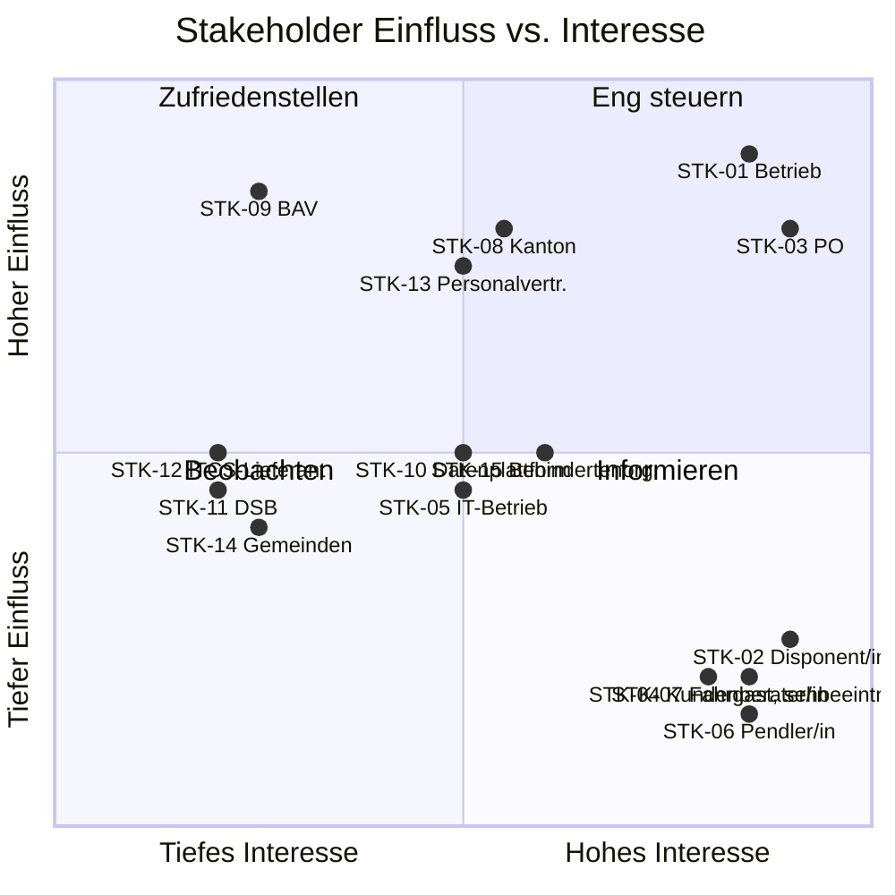

# Stakeholder-Register

Status: baselined, v1.1

## 1. Register

| ID | Stakeholder | Typ | Interesse an PRISMA | Einfluss | Interesse | Engagement |
|---|---|---|---|---|---|---|
| STK-01 | Leiter Betrieb (Sponsor) | Intern | Konzessionskonformität, Leitstelleneffizienz | Hoch | Hoch | Eng steuern — Lenkungsausschuss |
| STK-02 | Leitstellen-Disponent/in | Intern, primäre/r Nutzer/in | Weniger manuelle Schritte unter Zeitdruck | Tief | Hoch | Einbeziehen — Workshops, Usability-Tests |
| STK-03 | Leitung Fahrgastinformation (PO) | Intern | Verantwortet das Product Backlog | Hoch | Hoch | Eng steuern — täglich |
| STK-04 | Kundenberater/in | Intern, sekundäre/r Nutzer/in | Sieht die gleichen Informationen wie der Fahrgast | Tief | Hoch | Einbeziehen — Review der Kundendienst-Ansicht |
| STK-05 | IT-Betrieb RVB | Intern | Betreibbarkeit, Monitoring, Pikettbelastung | Mittel | Mittel | Zufriedenstellen — NFR-Review |
| STK-06 | Fahrgast — Pendler/in | Extern, primäre/r Nutzniesser/in | Genaue, aktuelle Abfahrts- und Störungsinformation | Tief | Hoch | Vertreten durch Persona + Benutzertests |
| STK-07 | Fahrgast — mit Sehbeeinträchtigung | Extern | Screenreader- und Audiozugang | Tief | Hoch | Einbeziehen — Behindertenorganisation konsultiert |
| STK-08 | Kantonales Verkehrsamt | Extern, Besteller | Wirtschaftlichkeit öffentlicher Mittel, Berichterstattung | Hoch | Mittel | Zufriedenstellen — Quartalsbericht |
| STK-09 | Bundesamt für Verkehr (BAV) | Regulierungsbehörde | Konzessionsbedingungen, Datenlieferpflicht | Hoch | Tief | Zufriedenstellen — Konformitätsnachweis |
| STK-10 | Betreiber nationale Open-Data-Plattform | Extern, Systempartner | Standardkonforme Feeds | Mittel | Mittel | Einbeziehen — Schnittstellenvereinbarung |
| STK-11 | Kantonale/r Datenschutzbeauftragte/r | Extern, Regulierung | Rechtmässige Verarbeitung personenbezogener Daten | Mittel | Tief | Konsultieren — DSFA-Freigabe |
| STK-12 | ITCS-Lieferant | Lieferant | Schnittstellenarbeiten, Vertragsumfang | Mittel | Tief | Zufriedenstellen — Schnittstellenvertrag |
| STK-13 | Personalvertretung / Personalverband | Intern | Keine verdeckte Leistungsüberwachung der Fahrer/innen | Hoch | Mittel | Konsultieren — frühzeitig, vor FR-Baseline |
| STK-14 | Gemeinden (24 Miteigentümer) | Extern, Eigentümer | Lokale Haltestellenabdeckung | Mittel | Tief | Informieren — Programm-Newsletter |
| STK-15 | Behindertenrechtsorganisation | Extern | BehiG-Konformität der Fahrgastkanäle | Mittel | Mittel | Konsultieren — Barrierefreiheits-Abnahme |

## 2. Einfluss-/Interesse-Matrix

## 3. Zu klärende Interessenkonflikte

| # | Spannung | Zwischen | Lösung |
|---|---|---|---|
| C-1 | Fahrzeugpositionsdaten ermöglichen sowohl Fahrgastinformation als auch Fahrer-Leistungsanalyse | STK-01 vs. STK-13 | Betriebsvereinbarung: Positionsdaten zweckgebunden, nach 24 h aggregiert, keine fahrerbezogene Auswertung. Wird zu CON-07 und NFR-014. |
| C-2 | Disponenten wollen schnellen Freitext; Kundendienst will standardisierte, übersetzbare Formulierungen | STK-02 vs. STK-04 | Strukturierte Meldungsvorlagen mit begrenztem Freitextfeld. Wird zu FR-008 / FR-009. |
| C-3 | Kanton will vollständigen Haltestellenanzeige-Rollout; Kostenobergrenze deckt nicht 412 Anzeigen | STK-08 vs. Budget | Priorisierter Rollout nach Einsteigerfrequenz; PRISMA liefert kanalagnostische API, Anzeigen können später folgen. Wird zu BR-05 und OPN-03. |
| C-4 | BAV will jetzt standardkonforme Feeds; ITCS-Lieferant verrechnet Schnittstellenarbeiten separat | STK-09 vs. STK-12 | Adapter wird RVB-seitig gegen die dokumentierte Legacy-Schnittstelle gebaut. Siehe ADR-002. |

## 4. RACI für die Anforderungsarbeit

| Aktivität | STK-01 | STK-02 | STK-03 | STK-05 | STK-08 | STK-11 | STK-13 |
|---|---|---|---|---|---|---|---|
| Geschäftsanforderungen erheben | A | C | R | C | C | I | C |
| Funktionale Anforderungen spezifizieren | I | C | R/A | C | I | I | C |
| Qualitätsanforderungen spezifizieren | I | I | R | A | I | C | I |
| Rechts- / Datenschutz-Review | I | I | R | I | I | A | C |
| Spezifikation baselinen | A | I | R | C | C | C | C |
| Change Request genehmigen | A | I | R | C | C | I | C |

R = verantwortlich (responsible), A = rechenschaftspflichtig (accountable), C = konsultiert, I = informiert.
