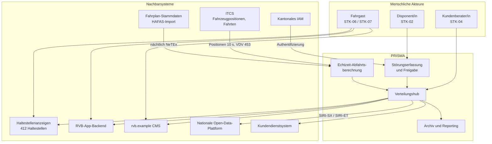
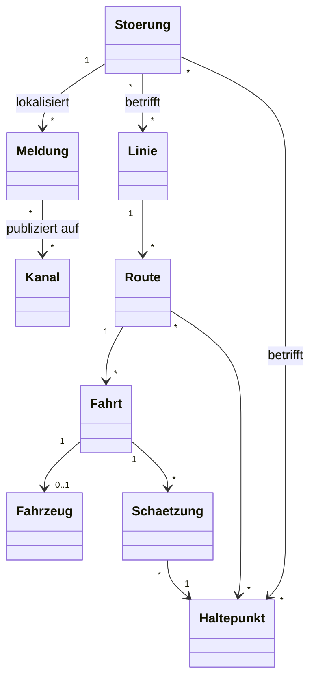

# Kontext und Geltungsbereich

Status: baselined, v1.3

## 1. Systemkontext

## 2. Externe Schnittstellen

| ID | Partnersystem | Richtung | Inhalt | Protokoll / Format | Häufigkeit | Verantwortlich |
|---|---|---|---|---|---|---|
| IF-01 | ITCS | ein | Fahrzeugpositionen, Fahrtfortschritt, Abweichungen | VDV 453 Subscription | alle 10 s | STK-12 |
| IF-02 | Fahrplan-Stammdaten | ein | Geplante Fahrten, Haltestellen, Kalender | NeTEx-Dateiablage | nächtlich 02:00 | RVB IT |
| IF-03 | Haltestellenanzeigen | aus | Abfahrtszeilen, Störungsbanner | Proprietäres Anzeigenprotokoll via Adapter | Push bei Änderung, ≤ 30 s | RVB IT |
| IF-04 | RVB-App-Backend | aus | Abfahrten, Störungen, Abonnements | REST/JSON, PRISMA API v1 | auf Anfrage + Push | RVB IT |
| IF-05 | Website-CMS | aus | Störungsliste pro Linie | REST/JSON | bei Änderung | RVB Kommunikation |
| IF-06 | Nationale Open-Data-Plattform | aus | Situationen und geschätzter Fahrplan | SIRI-SX, SIRI-ET 2.0 | SX bei Änderung, ET alle 30 s | STK-10 |
| IF-07 | Kundendienstsystem | aus | Aktueller Störungskontext für den Bildschirm der Kundenberater/innen | REST/JSON | auf Anfrage | RVB IT |
| IF-08 | Kantonales IAM | ein | Authentifizierung und Rollenansprüche für Personal | OIDC | pro Sitzung | Kanton |
| IF-09 | Reporting-Data-Mart | aus | Anonymisierte Pünktlichkeits- und Latenz-KPIs | Geplanter Export | täglich | RVB Controlling |

## 3. Scope-Entscheidungstabelle

| Thema | Drin | Draussen | Begründung |
|---|:--:|:--:|---|
| Erfassung von Störungsmeldungen | ✓ | | Kernproblem |
| Freigabeworkflow für Meldungen | ✓ | | Qualität und Haftung |
| Automatische Übersetzung DE→FR/IT/EN | ✓ | | Mehrsprachiges Konzessionsgebiet |
| Echtzeit-Abfahrtsschätzung | ✓ | | Erforderlich für ET-Feed |
| Fahrzeuglokalisierungsalgorithmus | | ✗ | Verbleibt im ITCS (ADR-002) |
| Dienstplan, Dispositionsentscheide | | ✗ | Eigene ITCS-Domäne |
| Beschaffung Anzeige-Hardware | | ✗ | Separates Infrastrukturprojekt |
| App-Benutzeroberfläche | | ✗ | PRISMA liefert nur API |
| Ticketing und Tarife | | ✗ | Anderer Wertstrom |
| Bordansagen | | ✗ | Phase-2-Kandidat, siehe OPN-05 |

## 4. Domänenmodell (konzeptuell)

## 5. Begriffliche Abgrenzung

`Störung` ist das massgebliche Geschäftsobjekt; `Meldung` ist eine lokalisierte, kanalspezifische
Darstellung davon. Diese Unterscheidung bestimmt FR-007 bis FR-012 und ist der Grund, warum eine
Änderung an der Störung nie ein erneutes Eintippen pro Kanal erfordert. Siehe `03-glossary.md`.
