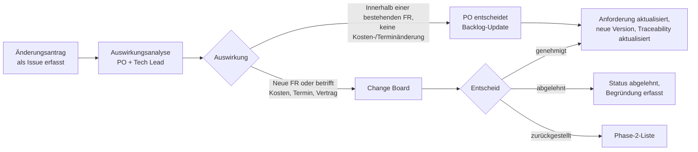

# Review-, Baseline- und Änderungsprozess

## 1. Qualitätskriterien für eine Anforderung

Eine Anforderung besteht das Review nur, wenn alle folgenden Kriterien erfüllt sind. Dies ist
die Checkliste, die im Pull-Request-Template verwendet wird.

| # | Kriterium | Typischer Fehler |
|---|---|---|
| 1 | **Notwendig** — Rückverfolgbarkeit zu einer Geschäftsanforderung | «Nice to have» ohne übergeordnete BR |
| 2 | **Eindeutig** — nur eine Lesart | «schnell», «benutzerfreundlich», «wie gefordert» |
| 3 | **Verifizierbar** — eine angegebene Methode weist es nach | Kein Abnahmekriterium |
| 4 | **Atomar** — eine Anforderung pro Aussage | «und ausserdem»-Ketten |
| 5 | **Designfrei** — beschreibt Was, nicht Wie | Nennt eine Technologie oder ein Bildschirmlayout |
| 6 | **Konsistent** — kein Widerspruch zu einer anderen Anforderung | Zwei verschiedene Latenzziele |
| 7 | **Machbar** — bestätigt durch den Technical Lead | Widerspricht CON-05 |
| 8 | **Priorisiert** — muss / sollte / kann zugewiesen | Alles «muss» |
| 9 | **Verwendet Glossarbegriffe** exakt | «Nachricht» verwendet, wo «Störung» gemeint ist |
| 10 | **Zugeordnet** — Quell-Stakeholder erfasst | Niemand weiss, wer es verlangt hat |

## 2. Review-Typen

| Typ | Wann | Teilnehmende | Ergebnis |
|---|---|---|---|
| Peer-Review | Jeder PR, der `anforderungsspezifikation/` oder `requirements.yaml` betrifft | 1 Reviewer aus dem RE-Team | PR-Genehmigung |
| Walkthrough | Neuer Use Case oder grösserer FR-Block | PO, Disponent, Technical Lead | Befundliste |
| Formale Inspektion | Vor dem Baselining eines Dokuments | PO, Sponsor, IT, betroffene Regulatoren | Unterzeichnetes Baseline |
| Perspektivenbasiertes Lesen | Vor Ausschreibungspublikation | Reviewer nimmt nacheinander die Rolle von Benutzer, Tester, Entwickler, Regulator ein | Fehlerliste |

## 3. Baselining

Ein Dokument wird `baselined`, wenn die formale Inspektion keine offenen kritischen Befunde
aufweist und die Abnahmetabelle vollständig ist. Ab diesem Zeitpunkt erfordern Änderungen
einen Änderungsantrag. Baselines werden in Git getaggt: `baseline/srs-v1.4`.

## 4. Änderungsprozess

**Change Board:** Sponsor (STK-01, verantwortlich), PO (STK-03), IT (STK-05) und — wenn die
Änderung CON-02, CON-03, CON-06 oder CON-07 betrifft — der betreffende Regulator oder STK-13.
Tagt alle zwei Wochen oder innerhalb von 48 h bei Änderungen, die einen Sprint blockieren.

**Die Auswirkungsanalyse muss enthalten:** betroffene Anforderungen nach ID, betroffene
Testfälle, Auswirkung auf die Traceability-Matrix, Kosten- und Terminauswirkung sowie
Auswirkung auf allfällige Compliance-Nachweise.

## 5. Versionierungsregeln

- Änderungen am Anforderungstext → Minor-Version des Dokuments erhöhen, im Änderungsprotokoll
  erfassen.
- Eine Anforderung, deren Bedeutung sich wesentlich ändert, erhält eine **neue ID**, und die
  alte wird als `superseded` mit Verweis gekennzeichnet. Bedeutungserhaltende Umformulierungen
  behalten die ID.
- IDs werden nie wiederverwendet.

## 6. Definition of Ready (Backlog-Element)

Eine User Story gelangt nur in einen Sprint, wenn: sie ihre übergeordnete FR benennt,
Abnahmekriterien in Given/When/Then-Form hat, kein unbeantworteter offener Punkt sie
blockiert, sie geschätzt ist und — wenn sie einen fahrgastbezogenen Kanal betrifft — ein
Barrierefreiheits-Abnahmekriterium hat.
