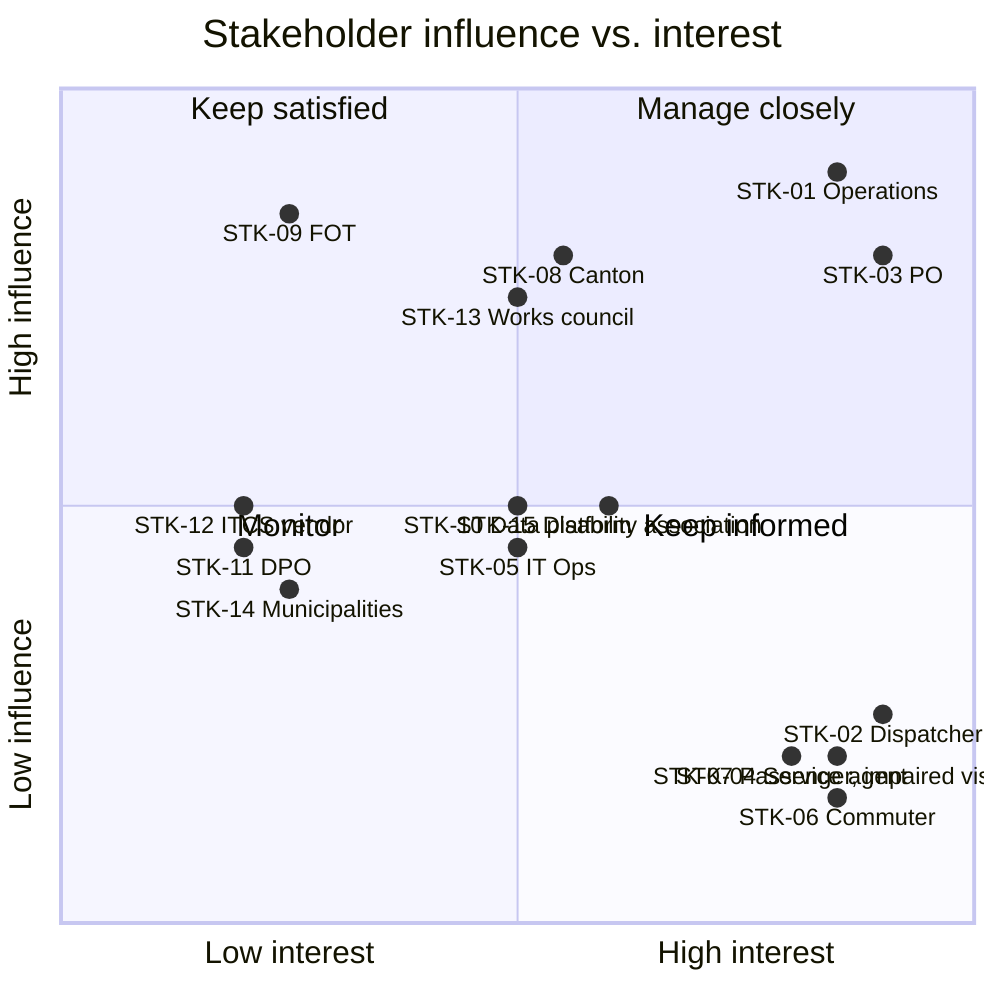

# Stakeholder Register

Status: baselined, v1.1

## 1. Register

| ID | Stakeholder | Type | Interest in PRISMA | Influence | Interest | Engagement |
|---|---|---|---|---|---|---|
| STK-01 | Head of Operations (Sponsor) | Internal | Concession compliance, control-centre efficiency | High | High | Manage closely — steering committee |
| STK-02 | Control-centre dispatcher | Internal, primary user | Fewer manual steps under time pressure | Low | High | Involve — workshops, usability tests |
| STK-03 | Passenger Information Lead (PO) | Internal | Owns the product backlog | High | High | Manage closely — daily |
| STK-04 | Customer service agent | Internal, secondary user | Sees the same information as the passenger | Low | High | Involve — review of desk view |
| STK-05 | IT Operations RVB | Internal | Operability, monitoring, on-call load | Medium | Medium | Keep satisfied — NFR review |
| STK-06 | Passenger — commuter | External, primary beneficiary | Accurate, timely departure and disruption info | Low | High | Represented by persona + user testing |
| STK-07 | Passenger — with visual impairment | External | Screen-reader and audio access | Low | High | Involve — accessibility body consulted |
| STK-08 | Cantonal transport office | External, funder | Value for public money, reporting | High | Medium | Keep satisfied — quarterly report |
| STK-09 | Federal Office of Transport (FOT) | Regulator | Concession conditions, data delivery duty | High | Low | Keep satisfied — compliance evidence |
| STK-10 | National open-data platform operator | External, system partner | Standard-conformant feeds | Medium | Medium | Involve — interface agreement |
| STK-11 | Cantonal data protection officer | External, regulator | Lawful processing of personal data | Medium | Low | Consult — DPIA sign-off |
| STK-12 | ITCS vendor | Supplier | Interface work, contract scope | Medium | Low | Keep satisfied — interface contract |
| STK-13 | Works council / staff association | Internal | No covert performance monitoring of drivers | High | Medium | Consult — early, before FR baseline |
| STK-14 | Municipalities (24 co-owners) | External, owner | Local stop coverage | Medium | Low | Inform — programme newsletter |
| STK-15 | Disability rights association | External | BehiG conformity of passenger channels | Medium | Medium | Consult — accessibility acceptance |

## 2. Influence / interest grid

## 3. Conflicting interests to resolve

| # | Tension | Between | Resolution |
|---|---|---|---|
| C-1 | Vehicle position data enables both passenger info and driver performance analysis | STK-01 vs. STK-13 | Works agreement: position data purpose-limited, aggregated after 24 h, no per-driver reporting. Becomes CON-07 and NFR-014. |
| C-2 | Dispatchers want free-text speed; customer service wants standardised, translatable wording | STK-02 vs. STK-04 | Structured message templates with a constrained free-text slot. Becomes FR-008 / FR-009. |
| C-3 | Canton wants full stop-display rollout; cost ceiling does not cover 412 displays | STK-08 vs. budget | Prioritised rollout by boarding volume; PRISMA delivers channel-agnostic API so displays can follow later. Becomes BR-05 and OPN-03. |
| C-4 | FOT wants standard-conformant feeds now; ITCS vendor bills interface work separately | STK-09 vs. STK-12 | Adapter built on RVB side against the documented legacy interface. See ADR-002. |

## 4. RACI for the requirements work

| Activity | STK-01 | STK-02 | STK-03 | STK-05 | STK-08 | STK-11 | STK-13 |
|---|---|---|---|---|---|---|---|
| Elicit business requirements | A | C | R | C | C | I | C |
| Specify functional requirements | I | C | R/A | C | I | I | C |
| Specify quality requirements | I | I | R | A | I | C | I |
| Legal / data protection review | I | I | R | I | I | A | C |
| Baseline the specification | A | I | R | C | C | C | C |
| Approve a change request | A | I | R | C | C | I | C |

R = responsible, A = accountable, C = consulted, I = informed.
