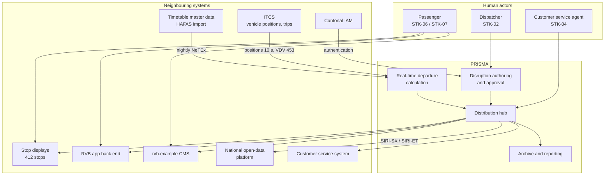
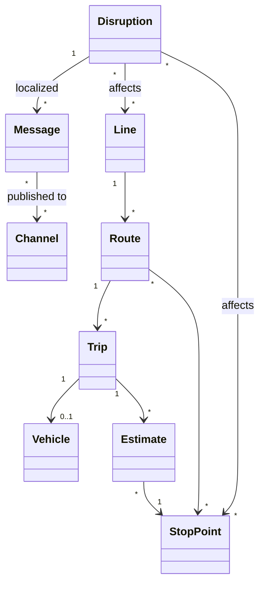

# Context and Scope

Status: baselined, v1.3

## 1. System context

## 2. External interfaces

| ID | Partner system | Direction | Content | Protocol / format | Frequency | Owner |
|---|---|---|---|---|---|---|
| IF-01 | ITCS | in | Vehicle positions, trip progress, deviations | VDV 453 subscription | every 10 s | STK-12 |
| IF-02 | Timetable master data | in | Planned trips, stops, calendars | NeTEx file drop | nightly 02:00 | RVB IT |
| IF-03 | Stop displays | out | Departure rows, disruption banner | proprietary display protocol via adapter | push on change, ≤ 30 s | RVB IT |
| IF-04 | RVB app back end | out | Departures, disruptions, subscriptions | REST/JSON, PRISMA API v1 | on demand + push | RVB IT |
| IF-05 | Website CMS | out | Disruption list per line | REST/JSON | on change | RVB comms |
| IF-06 | National open-data platform | out | Situations and estimated timetable | SIRI-SX, SIRI-ET 2.0 | SX on change, ET every 30 s | STK-10 |
| IF-07 | Customer service system | out | Current disruption context for the agent's screen | REST/JSON | on demand | RVB IT |
| IF-08 | Cantonal IAM | in | Authentication and role claims for staff | OIDC | per session | Canton |
| IF-09 | Reporting data mart | out | Anonymised punctuality and latency KPIs | scheduled extract | daily | RVB controlling |

## 3. Scope decision table

| Topic | In | Out | Rationale |
|---|:--:|:--:|---|
| Authoring of disruption messages | ✓ | | Core problem |
| Approval workflow for messages | ✓ | | Quality and liability |
| Automatic translation DE→FR/IT/EN | ✓ | | Multilingual concession area |
| Real-time departure estimation | ✓ | | Required for ET feed |
| Vehicle localisation algorithm | | ✗ | Stays in ITCS (ADR-002) |
| Duty roster, dispatch decisions | | ✗ | Separate ITCS domain |
| Display hardware procurement | | ✗ | Separate infrastructure project |
| App UI | | ✗ | PRISMA delivers API only |
| Ticketing and fares | | ✗ | Different value stream |
| On-board announcements | | ✗ | Phase 2 candidate, see OPN-05 |

## 4. Domain model (conceptual)

## 5. Terminology note

`Disruption` is the authoritative business object; `Message` is one localised, channel-shaped
rendering of it. This distinction drives FR-007 to FR-012 and is the reason a change to the
disruption never requires re-typing per channel. See `03-glossary.md`.
