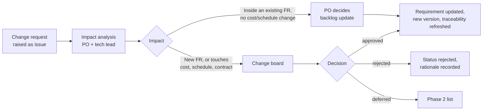

# Review, Baseline and Change Process

## 1. Quality criteria for a requirement

A requirement passes review only if all of the following hold. This is the checklist used in
the pull-request template.

| # | Criterion | Typical failure |
|---|---|---|
| 1 | **Necessary** — traces to a business requirement | "Nice to have" with no parent BR |
| 2 | **Unambiguous** — one reading only | "fast", "user-friendly", "as required" |
| 3 | **Verifiable** — a stated method proves it | No acceptance criterion |
| 4 | **Atomic** — one requirement per statement | "and also" chains |
| 5 | **Free of design** — states what, not how | Names a technology or a screen layout |
| 6 | **Consistent** — no conflict with another requirement | Two different latency targets |
| 7 | **Feasible** — confirmed with the technical lead | Contradicts CON-05 |
| 8 | **Prioritised** — must / should / may assigned | Everything "must" |
| 9 | **Uses glossary terms** exactly | "message" used where "disruption" is meant |
| 10 | **Attributed** — source stakeholder recorded | Nobody knows who asked for it |

## 2. Review types

| Type | When | Participants | Output |
|---|---|---|---|
| Peer review | Every PR touching `docs/` or `requirements/` | 1 reviewer from the RE team | PR approval |
| Walkthrough | New use case or major FR block | PO, dispatcher, technical lead | Findings list |
| Formal inspection | Before baselining a document | PO, sponsor, IT, affected regulators | Signed baseline |
| Perspective-based reading | Before tender publication | Reviewer takes the role of user, tester, developer, regulator in turn | Defect log |

## 3. Baselining

A document becomes `baselined` when the formal inspection has no open critical findings and
the sign-off table is complete. From that moment, changes require a change request.
Baselines are tagged in git: `baseline/srs-v1.4`.

## 4. Change process

**Change board:** sponsor (STK-01, accountable), PO (STK-03), IT (STK-05), and — where the
change touches CON-02, CON-03, CON-06 or CON-07 — the relevant regulator or STK-13.
Meets fortnightly, or within 48 h for changes blocking a sprint.

**Impact analysis must state:** affected requirements by ID, affected test cases, effect on
the traceability matrix, cost and schedule effect, and effect on any compliance evidence.

## 5. Versioning rules

- Requirement text changes → increment the document minor version, record in the change log.
- A requirement whose meaning changes materially gets a **new ID**, and the old one becomes
  `superseded` with a pointer. Meaning-preserving rewording keeps the ID.
- IDs are never reused.

## 6. Definition of ready (backlog item)

A user story enters a sprint only if: it names its parent FR, has acceptance criteria in
Given/When/Then form, has no unanswered open point blocking it, has been sized, and — where it
touches a passenger-facing channel — has an accessibility acceptance criterion.
